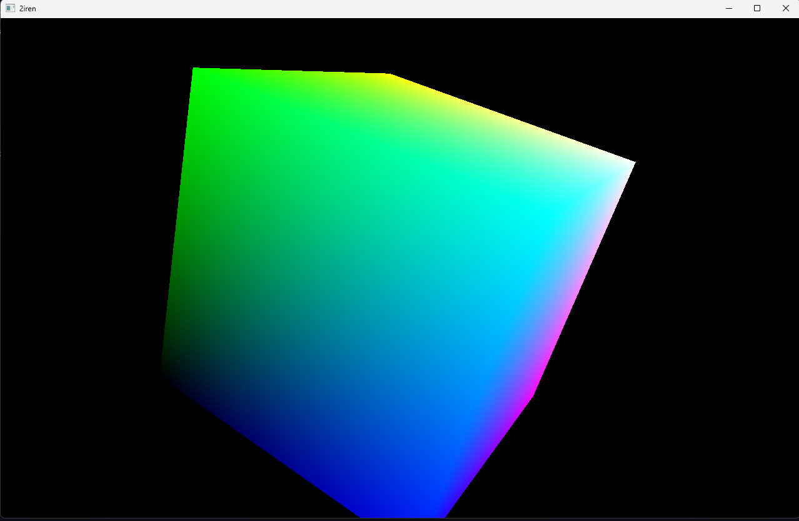

# 2iREN

2iREN is a c++23 rendering framework. The code originates from the [siren](https://github.com/sleeepyskies/siren)
game engine, but has since evolved further.

Currently only OpenGL 4.6 is supported, but other APIs may be supported in the future.

## Building 2iREN

2iREN uses Conan for package management, as well as Just for running commands.

To build 2iREN, make sure you have both of these installed.

After cloning the repository, first run:

```bash
just configure
```

To fetch dependencies and configure CMake. Then run:

```bash
just build
```

To build the library.

## Dependencies

* **stb**: Used for image saving and loading.
* **cgltf**: Loading gltf files.
* **yaml-cpp**: Used for yaml file parsing.
* **GLFW**: Windowing
* **glad**: OpenGL loader
* **OpenGL**: Graphics API.

## Running Tests

2iREN uses DocTest. Tests can be run via:

```bash
just test
```

## Project Components

2iREN has has various modules (logical modules, not c++ modules) that make the framework.

* `asset`:
* `concurrency`:
* `core`:
* `graphics`:
* `input`:
* `math`:
* `scene`:
* `utility`:

## Examples

2iREN has multiple examples to showcase what can be done using the framework, as
well as to demonstrate how to use the API. Examples can be found under:

```
examples/
```

The 2iREN examples can be run via:

```bash
just example-[name]
```

2iREN includes a set of examples to show how to use the library. These can be
found under `/examples`.

For a more detailed look into how 2iREN can be used as a framework, checkout
oiter.

1 Rainbow Triangle


2 Spinning Cube



3 Load Shader

Demos loading a simple asset from the VFS. Also shows the yaml like file type
for defining 2iREN shaders.

4 Load Gltf (WIP)

Demos loading a mesh from a gltf file using the asset server and rendering it.
