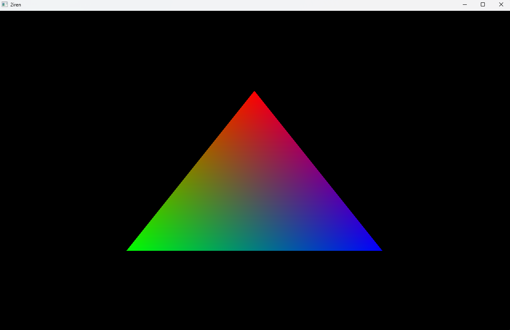

# 2iren
2iren is a simple cpp23 rendering library extracted and modified from the [siren](https://github.com/sleeepyskies/siren) game engine.

Currently only OpenGL 4.6 is supported, but other APIs may be supported in the future.

## Features
- **Multithreaded**: 2iren has the option to run in multithreaded mode. If enabled command recording is decoupled 
  from the backend execution.
- **Utilities**: 2iren provides some qol helpers to simplify usual annoyances such as ByteBuffer for creating 
  buffers with various types and LayoutBuilder for describing vertex buffer layouts.
- **RAII Resources**: All render resources (Buffers, Pipelines, Shaders, etc.) are RAII-compliant.

## Dependencies
Conan is used for package management.
* **yaml-cpp**: Used for certain 2iren specific file types (sshg etc.).
* **GLFW**: Windowing
* **GLM**: Math library
* **libassert**: Runtime assertions with stacktrace output
* **glad**: OpenGL loader
* **OpenGL**: Rendering API

# Examples
2iren includes a set of examples to show how to use the library:
1. Rainbow Triangle

2. Spinning Cube
 

3. Load Shader
 
Demos loading a simple asset from the VFS.